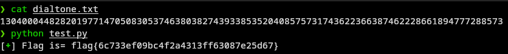

# ChatonCTF, votre assitant félin pour les CTF

## Installation

Installer les dépendences utiliser par le module:

```bash
pip install -r requirements.txt
```

puis dans votre script importer le module

```python
import chatonCTF
```

## Explications

ChatonCTF est un module python à charger pour faciliter les challenges.

pour le moment, il est capable des options suivantes:

### FlagFinder

En lui passant un pattern et un fichier, le chaton est capable de chercher sa cible et de stocker le résultat dans un fichier flag.txt

### Binary Scan/Extract

Avec cette option, le chaton peut scanner et/ou extraire les données d'un firmware.
Avec l'aide de binwalk

### RSA

Le chaton peut vous aider avec les challenges RSA en calculant les données suivantes:

- Calculer **N** si vous avez **P** et **Q**
- Calculer **P** ou **Q** si vous avez **N** et un membre du binôme à trouver
- Calculer **Phi(n)** si vous lui fournissez **P** et **Q**
- Calculer **D** Si vous avez **Phi(n)** et **E**
- Trouver les messages Chiffrés/Déchiffrés
- Exploiter faiblesse si **E=3** 

### Integer to ASCII

Le chaton peut convertir une chaine Bignum vers sa représentation ASCII


### Reverse String
Le chaton peut inverser l'ordre des lettres quand il le faut

## Outro

ChatonCTF est modulaire, et sera mis à jour au fur et à mesure que j'apprendrai de nouvelles techniques
